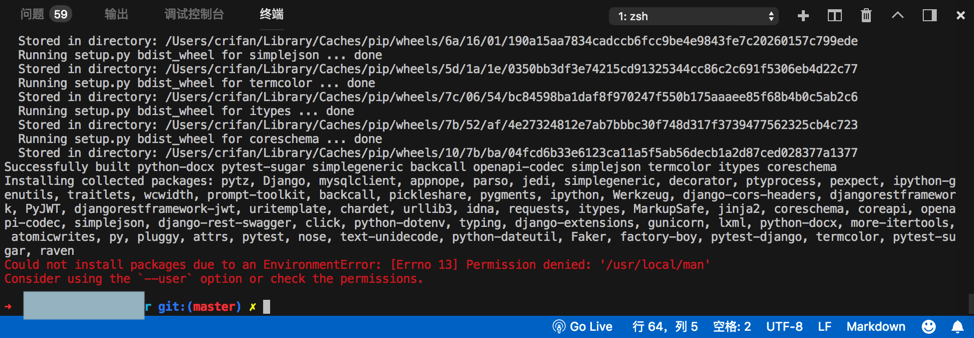

# Errno 13 Permission denied

## Could not install packages due to an EnvironmentError: [Errno 13] Permission denied: /usr/local/man

**现象**：

```bash
pip3 install -r requirements.txt
```

报错：

```bash
  xxx git:(master) pip3 install -r requirements.txt
Collecting Django==2.0.6 (from -r requirements.txt (line 1))
  Downloading https://files.pythonhosted.org/packages/56/0e/afdacb47503b805f3ed213fe732bff05254c8befaa034bbada580be8a0ac/Django-2.0.6-py3-none-any.whl (7.1MB)
    100% |████████████████████████████████| 7.1MB 12kB/s
Collecting mysqlclient==1.3.12 (from -r requirements.txt (line 2))
Requirement already satisfied: pymongo==3.6.1 in /usr/local/lib/python3.6/site-packages (from -r requirements.txt (line 3)) (3.6.1)
Collecting ipython==6.4.0 (from -r requirements.txt (line 4))
  。。。
  Running setup.py bdist_wheel for itypes … done
  Stored in directory: /Users/crifan/Library/Caches/pip/wheels/7b/52/af/4e27324812e7ab7bbbc30f748d317f3739477562325cb4c723
  Running setup.py bdist_wheel for coreschema … done
  Stored in directory: /Users/crifan/Library/Caches/pip/wheels/10/7b/ba/04fcd6b33e6123ca11a5f5ab56decb1a2d87ced028377a1377
Successfully built python-docx pytest-sugar simplegeneric backcall openapi-codec simplejson termcolor itypes coreschema
Installing collected packages: pytz, Django, mysqlclient, appnope, parso, jedi, simplegeneric, decorator, ptyprocess, pexpect, ipython-genutils, traitlets, wcwidth, prompt-toolkit, backcall, pickleshare, pygments, ipython, Werkzeug, django-cors-headers, djangorestframework, PyJWT, djangorestframework-jwt, uritemplate, chardet, urllib3, idna, requests, itypes, MarkupSafe, jinja2, coreschema, coreapi, openapi-codec, simplejson, django-rest-swagger, click, python-dotenv, typing, django-extensions, gunicorn, lxml, python-docx, more-itertools, atomicwrites, py, pluggy, attrs, pytest, nose, text-unidecode, python-dateutil, Faker, factory-boy, pytest-django, termcolor, pytest-sugar, raven
Could not install packages due to an EnvironmentError: [Errno 13] Permission denied: ‘/usr/local/man’
Consider using the `–-user` option or check the permissions.
```



**原因**：没有权限

**解决办法**：给（当前用户）加上权限，或者（通过`--user`）改用当前用户权限

**操作步骤**：

* 给（当前用户）加上权限
  * 给/usr/local加上权限，或者把拥有者ower换成自己
    ```bash
    sudo chown -R crifan /usr/local
    ```
    * 或：
      ```bash
      sudo chown -R $USER /usr/local
      ```
* 通过`--user`改用当前用户权限
  ```bash
  pip3 install –-user -r requirements.txt
  ```
  * 其他类似的问题的解决办法，也是加`--user`
    ```bash
    python -m pip install -U pylint --user
    ```
